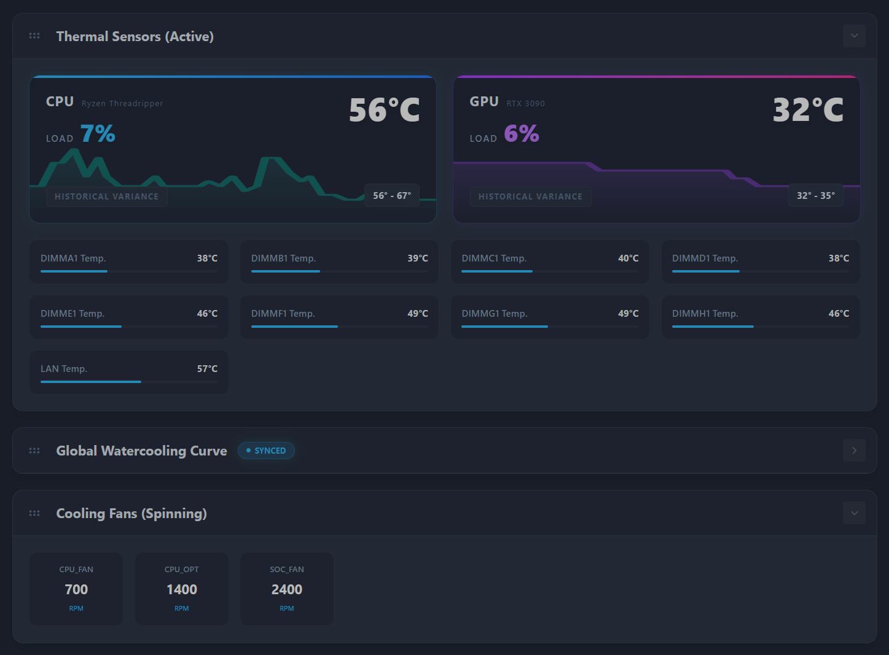
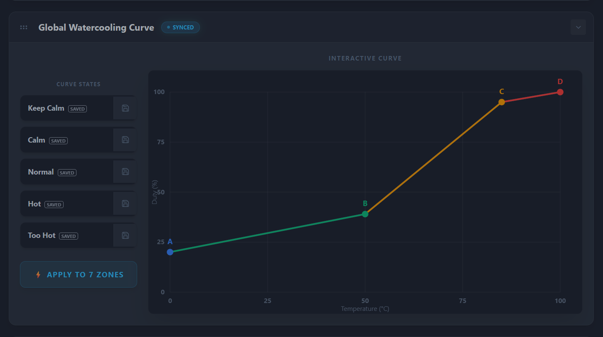

# Asus BMC Fan Control Dashboard

A modern, highly interactive web dashboard to monitor and control cooling fans for the **ASUS Pro WS WRX80E-SAGE SE WIFI** motherboard via its onboard MegaRAC BMC API. 

## Features
- **Real-Time Hardware Metrics**: Direct Node.js polling for Ryzen Threadripper CPU Load (`os.cpus()`) and RTX 3090 GPU Load (via `nvidia-smi`).
- **Interactive Fan Curve Editor**: Fully draggable, vector-based SVG fan curve editor with interpolation and live tooltips.
- **Fast 5-Slot Presets**: One-click, double-click to instantly apply custom RPM zones directly to the BMC.
- **Sparklines & Analytics**: Built-in visual sparklines for thermal variance and a historic 5-minute time-series chart.
- **Drag-and-Drop Layout**: Built with the WeAi grid manager to allow custom sorting and collapsing of widget rows, saving your perfect setup directly to `localStorage`.

## Screenshots / Aperçu
*(Pour un rendu optimal sur GitHub, déposez vos images dans le dossier `doc/` de ce dépôt)*

*Vue principale montrant les cartes CPU/GPU avec leurs Sparklines intégrés et les statistiques thermiques.*

*Éditeur vectoriel SVG interactif avec les profils de ventilation instantanés sur la gauche.*

## Tech Stack
- **Frontend**: React, Vite, TailwindCSS (for pure styling), Recharts, dnd-kit.
- **Backend**: Fastify (Node.js) acting as a secure middleman intercepting Web API endpoints on the Asus BMC controller.
